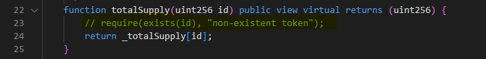
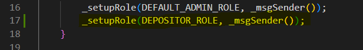

# Cool Cats Solidity Test

## ERC1155SupplyCC.sol
Why was this file used and not used directly from the OpenZeppling library?
### My Opinion:
The main reason would be that you want a function
that get supply of each `id` purely rather than puting `account`
like `balanceOf` function in ERC1155 where we only get
owned `id` per specific `account`.
And Yes this way we can also rectify NFT if any.

### Minor issue
#1. A `require` statement should be used in `totalSupply` function to verify if entered 
`id` is exists or not i.e. `require(exists(id));`

#2. Extra code in second if condition line 53:
it can be simple as above if condtion

## Milk.sol | Flaws
#1. Compile time errors (Total 6)

- CONTRACT_ROLE is being used in below 4 functions but not defined to any address on
constructor
1. gameWithdraw
2. gameTransferFrom
3. gameBurn
4. gameMint
- MASTER_ROLE is being used `mint` function but not defined to any address on
constructor
- Wrong use of `override` in `deposit` function  

#2. `DEPOSITOR_ROLE` in not given to any address i.e. `_setupRole(DEPOSITOR_ROLE, _msgSener());`

## itemFactory.sol | Flaws

Compile time errors (Total 12)

Un-declared things i.e. lootData, EType, event: LogDailyClaim, petTokenId,
_maxRarityRoll parameter in `setRarityRolls` function, wrong use of `ADMIN_ROLE`
instead of `DEFAULT_ADMIN_ROLE` in both `setRarityRolls` & `setReward` functions and 
missing Interface of Milk contract in ItemFactory contract for `gameMint` function call
